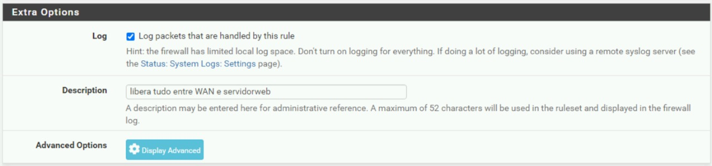
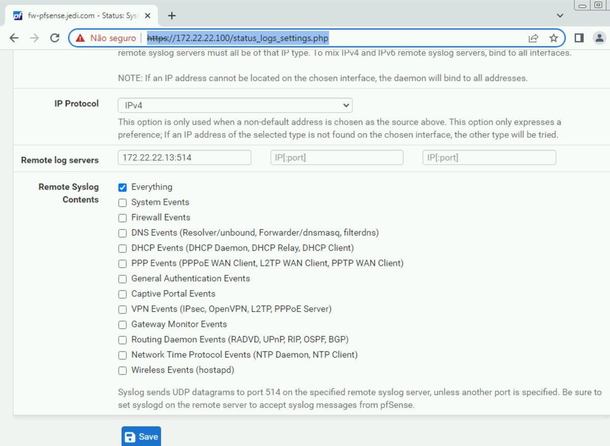

# *pf*Sense

O *pf*Sense é uma solução de Firewall largamente adotada e uma das mais robustas entre as opções OpenSource que substitui com sucesso _na maioria das necessidades_ os principais firewall comerciais existentes no mercado como CheckPoint, Sonicwall, Juniper, entre outros.

Treinamento gratuito: [www.learncafe.com](https://www.learncafe.com/cursos/curso-completo---como-instalar-e-configurar-o-pfsense)  
Treinamento oficial: [Netgate Training and Certification](https://www.pfsense.org/our-services/#pfsense-training)  
Repositório opensource: [github.com/*pf*sense](https://github.com/pfsense)  
Documentação: [*pf*Sense Documentation](https://docs.netgate.com/pfsense/en/latest/)

## Requisitos

> Sistema Operacional: Ubuntu Linux

|   Máquina Virtual | Mínimo  | Recomendado |
| ----------------: | :-----: | :---------: |
|    Processadores: |    2    |      4      |
|       Arquitetura | 64 bits |   64 bits   |
|      Memória RAM: |  1 GB   |    4 GB     |
|    Armazenamento: |  5 GB   |    16 GB    |
| Memória de vídeo: |    -    |      -      |

## Configuração

Para fazer a instalação do pfSense é necessário baixar uma ISO diretamente no site do pfSense. Para este projeto a ISO baixada encontrava-se na versão 2.6.0. Foi utilizado uma máquina virtual no Hyper-V sob as configurações iniciais de um sistema FreeBSD e foi adicionado a ISO correspondente no disco virtual. A instalação do firewall foi realizada da forma padrão clicando em “next” em todos os passos do procedimento, únicos dois adendos são a seleção de teclado padrão português brasileiro e a partição do disco também de maneira padrão na tela em que o instalador sugeriu tal situação. Após a instalação ser realizada foi necessário retirar a imagem do disco para que o sistema operacional se iniciasse ao invés de recomeçar uma nova instalação desnecessária.

O firewall pfSense foi configurado utilizando duas interfaces de rede, a interface WAN, que engloba as máquinas do Red Team e Blue Team, máquinas que dentro do escopo do projeto representam computadores externos a rede interna, cujo o IP gateway foi configurado como 10.0.0.100, e a interface LAN com o IP 172.22.22.100 para as demais máquinas presentes na rede interna: Windows Server, ELK Stack, Servidor DNS, Metasploitable e máquina de usuário. 

Ao realizar a configuração das interfaces foi possível, através do IP delas, acessar a interface gráfica do pfSense digitando o IP em um navegador para que assim as configurações de firewall fossem realizadas. 

Assim que foi obtido o acesso à interface gráfica, as primeiras configurações foram realizadas para deixar o firewall mais seguro, como por exemplo, trocar a senha de acesso a página web do mesmo e criar os certificados digitais para a página web ser acessada por HTTPS (Hypertext Transfer Protocol Secure). Em seguida foi criado as aliases necessárias contendo o nome e o IP de todas as máquinas do projeto. Tendo criado as aliases foram criadas as rules conforme foi estipulado no projeto com relação a conectividade entre as máquinas.
As rules criadas são: 

O Blue Team tem acesso total as todas as máquinas exceto a Kali Linux (Red Team); 

O Servidor Web e de DNS são acessíveis tanto na rede interna quanto externa. As demais máquinas não; 

O computador de usuário (User Machine) pode acessar computadores fora da rede, mas não pode ser acessado remotamente; 

O computador Blue Team pode acessar qualquer computador da rede interna; 

O computador Red Team pode acessar apenas o Servidor Web e Servidor de DNS. 

As rules foram devidamente criadas referenciando a interface WAN, já que as mesmas dizem respeito às máquinas do Red Team e Blue Team e, como tais, foram separadas e organizadas para facilitar a visualização de acordo com cada máquina. As rules foram criadas conforme anteriormente estipuladas e durante a criação foi habilitado a função de coleta de log de cada uma delas, para que quando uma delas fosse acionada o pfSense gerasse os logs correspondentes e os direcionasse para o ELK Stack. 

Foi criado uma função NAT Outbound entre os IPs da rede WAN e LAN para que os computadores cadastrados na rede externa pudessem se conectar na rede interna conforme as rules determinavam. 

Ademais, no intuito de diminuir ruído na rede e na coleta de logs, na aba de Services foi desabilitado todos os tipos de DHCP e NTP afim de diminuir logs que não sejam referentes as rules configuradas.

### Regras

1. LAN
   

2. WAN
   

## Aliases

## Outbound

## Dashboard

## Logs

1. Na criação das "rules"

2. Em Status -> System Logs -> Settings

# [![Home][homeimage]][homelink] [![Top][topimage]](#)

[topimage]: https://img.shields.io/badge/-Voltar_ao_topo-grey
[homeimage]: https://img.shields.io/badge/-Home-blue
[homelink]: ./../../../README.md#
