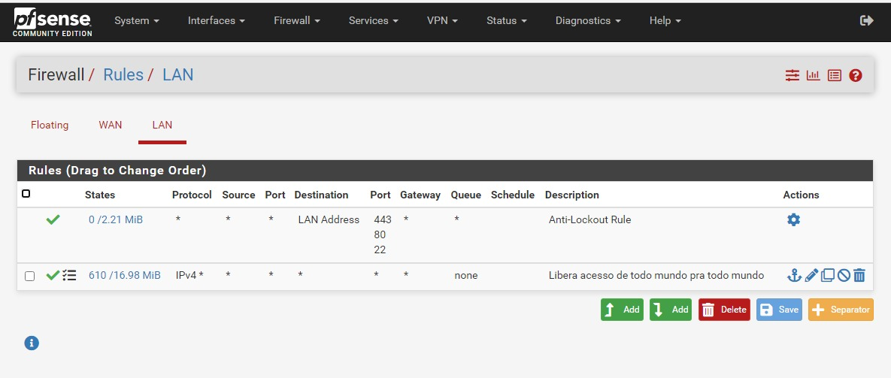
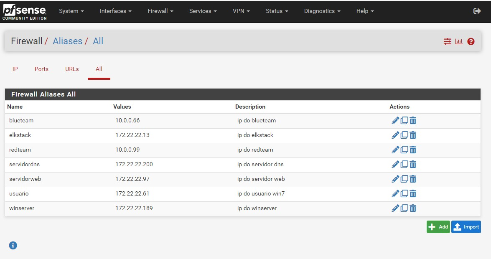
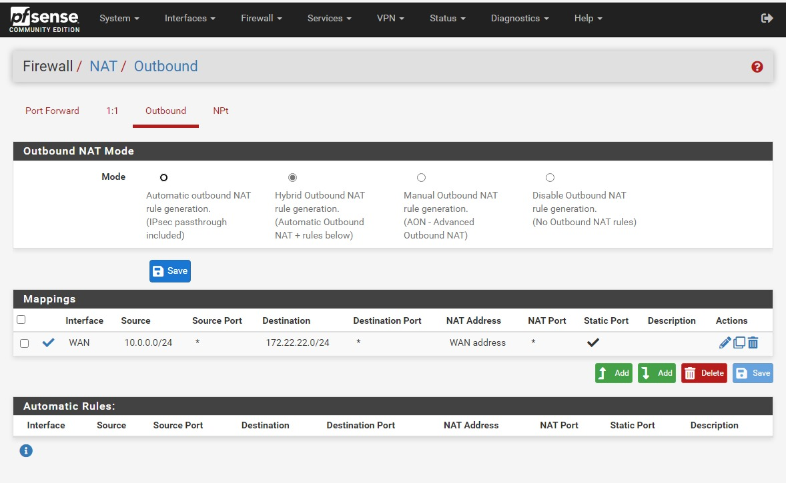
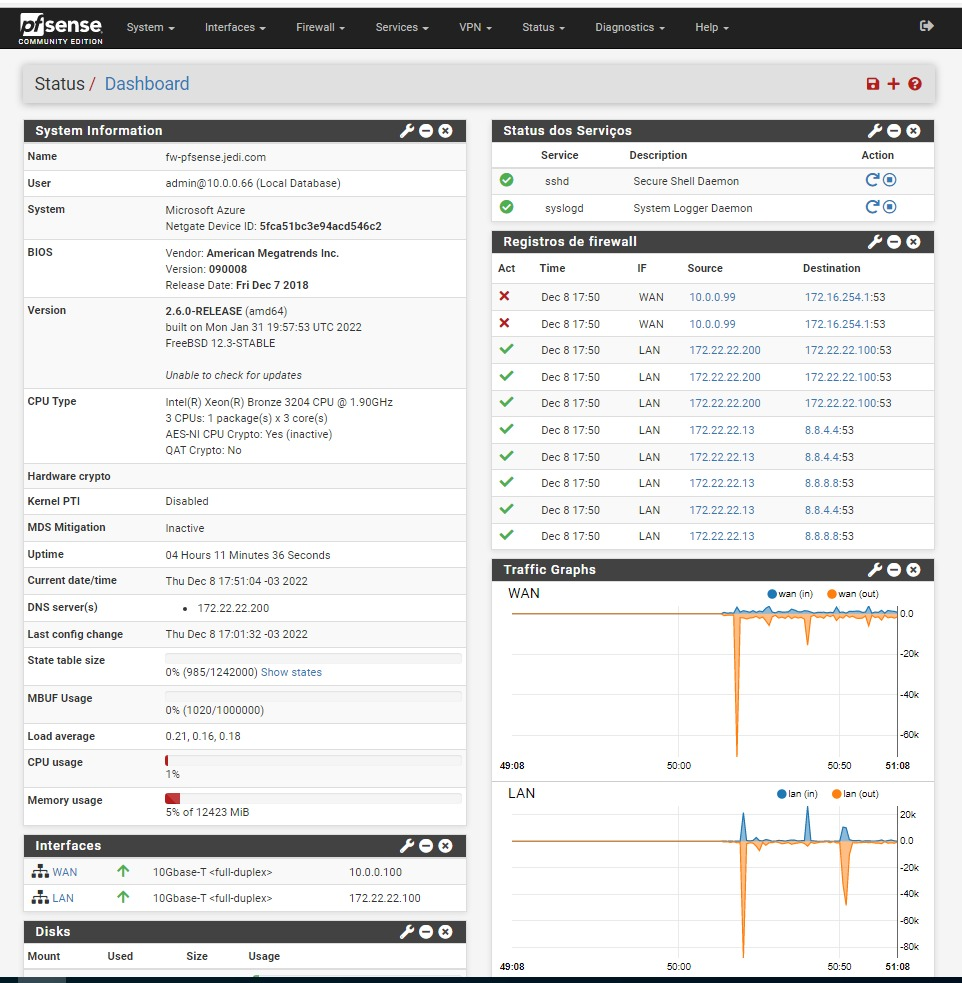

# *pf*Sense

O *pf*Sense é uma solução de Firewall largamente adotada e uma das mais robustas entre as opções OpenSource que substitui com sucesso _na maioria das necessidades_ os principais firewall comerciais existentes no mercado como CheckPoint, Sonicwall, Juniper, entre outros.

Treinamento gratuito: [www.learncafe.com](https://www.learncafe.com/cursos/curso-completo---como-instalar-e-configurar-o-pfsense)  
Treinamento oficial: [Netgate Training and Certification](https://www.pfsense.org/our-services/#pfsense-training)  
Repositório opensource: [github.com/*pf*sense](https://github.com/pfsense)  
Documentação: [*pf*Sense Documentation](https://docs.netgate.com/pfsense/en/latest/)

## Requisitos

> Sistema Operacional: Ubuntu Linux

|   Máquina Virtual | Mínimo  | Recomendado |
| ----------------: | :-----: | :---------: |
|    Processadores: |    2    |      4      |
|       Arquitetura | 64 bits |   64 bits   |
|      Memória RAM: |  1 GB   |    4 GB     |
|    Armazenamento: |  5 GB   |    16 GB    |
| Memória de vídeo: |    -    |      -      |

## Configuração

### Regras

1. LAN
   

1. WAN
   

## Aliases

## Outbound

## Dashboard

# [![Home][homeimage]][homelink] [![Top][topimage]](#)

[topimage]: https://img.shields.io/badge/-Voltar_ao_topo-grey
[homeimage]: https://img.shields.io/badge/-Home-blue
[homelink]: ./../../../README.md#
