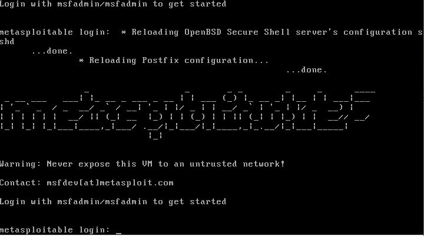

# Metasploitable 2

Metasploitable é uma máquina virtual Linux intencionalmente vulnerável.

Essa VM pode ser usada para realizar treinamento de segurança, testar ferramentas de segurança e praticar técnicas comuns de teste de penetração.

O login e a senha padrão são respectivamente 'msfadmin' e 'msfadmin'.

Nunca exponha esta VM a uma rede não confiável.

<!-- ## Requisitos

> Sistema Operacional: Ubuntu Linux

|      Máquina Virtual | Mínimo  | Recomendado |
| -------------------: | :-----: | :---------: |
|       Processadores: |    2    |      4      |
|          Arquitetura | 64 bits |   64 bits   |
|         Memória RAM: |  1 GB   |    4 GB     |
|       Armazenamento: |  5 GB   |    16 GB    |
|    Memória de vídeo: |  64 MB  |    64 MB    | -->

## Instalando Metasplitable 2 no Hyper-V

1. [Baixe][4] a máquina virtual do **Metasploitable** no formato .vmdk
1. Converta a máquina virtual .vmdk para .vhdx

    1.  Download: http://download.microsoft.com/download/9/1/E/91E9F42C-3F1F-4AD9-92B7-8DD65DA3B0C2/mvmc_setup.msi
    1.  Open Powershell as administrator and run

        `Import-Module 'C:\Program Files\Microsoft Virtual Machine Converter\MvmcCmdlet.psd1'`
    1.  And after

        `ConvertTo-MvmcVirtualHardDisk -SourceLiteralPath d:\scratch\vmx\VM-disk1.vmdk -VhdType DynamicHardDisk -VhdFormat vhdx -destination c:\vm-disk1`

    1. If you counter following error:

        > ConvertTo-MvmcVirtualHardDisk : The entry 1 is not a supported disk database entry for the descriptor.

        >In my case it was entry `4`

          Follow these [steps][2]:

        1.  download and extract dsfok tools
        1.  use `dsfo.exe "c:\temp\disk2.vmdk" 512 1024 descriptor1.txt` to extract the descriptor
        1.  edit the descriptor file in Notepad++: comment the above mentioned line (as I added the extra single character (#) I also deleted one NULL character from the end to keep the file size of 1024 bytes (not sure if this is needed).
        1.  use `dsfi.exe "c:\temp\disk2.vmdk" 512 1024 descriptor1.txt` to inject the descriptor back into the VMDK
        1.  repeat these steps for the other disk (my VM has two `.vmdk` files)
        1.  reissue the `ConvertTo-MvmcVirtualHardDisk` command

1.  No gerenciador do **Hyper-V** adicione o disco virtual convertido em .vhdx

    > [Tutorial][5]:

    1.  Open the Hyper-V Manager
    1.  In the left pane, right click and select New > Virtual Machine
    1.  In the New Virtual Machine Wizard click Next
    1.  Give your VM a suitable name, for example “MetaSploitable 2”
    1.  Check the option for Store the virtual machine in a different location, click Next
    1.  Select Generation 1, click Next
    1.  Change the Startup memory to 2048MB, click Next
    1.  Select the appropriate Connection in the drop-down, click Next
    1.  Check the option for Use an existing virtual hard disk
    1.  Click Browse and locate the converted hard disk file, click Next
    1.  Click Finish

        When you start the VM, you should see something like this:

        

2.  Configure Networking

    How you configure the network options for Metasploitable really depends on how you plan to use it. For me, I am generally run it on a server and I map it to a specific physical port on the server because I am using it for training on a non-business network.

3.  Accessing Metasploitable 2

    Once you have started the machine in Hyper-V, you can login via following credentials:

    - Username: msfadmin
    - Password: msfadmin

[1]: https://blogs.msdn.microsoft.com/timomta/2015/06/11/how-to-convert-a-vmware-vmdk-to-hyper-v-vhd/
[2]: http://stackoverflow.com/questions/37481737/error-when-converting-vmware-virtual-disk-to-hyperv
[3]: https://www.youtube.com/watch?v=5jKW5-aDvqg
[4]: https://sourceforge.net/projects/metasploitable/files/Metasploitable2/
[5]: https://bobmckay.com/i-t-support-networking/ethical-hacking/deploying-metasploitable-2-on-a-microsoft-server-with-hyper-v/
[6]: https://www.techtutsonline.com/setup-kali-linux-metasploitable-hyper-v-windows-10/

# [![Home][homeimage]][homelink] [![Top][topimage]](#)

[topimage]: https://img.shields.io/badge/-Voltar_ao_topo-grey
[homeimage]: https://img.shields.io/badge/-Home-blue
[homelink]: ././../../../README.md
