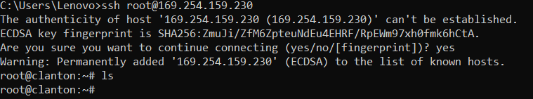
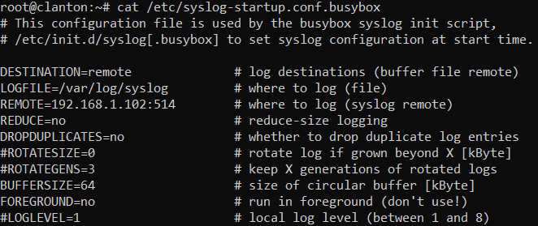

# Sumario

- [Instalando o SO](#instalando-sistema-operacional)
  - [Baixando Imagem](#1-baixe-imagem-do-so-poky-sdcard111tarbz2)
  - [Preparando Cartão SD](#2-prepare-cartão-sd)
  - [Instalação do SO](#3-instalação-do-so)  
- [Comunicação via SSH](#comunicação-ssh)
- [Configuração de IP Fixo](#configurando-ip-fixo)
- [Configurando a IDE do Arduino](#configure-a-ide-do-arduino)
- [Configuração do Syslog](#configurando-syslog)

# Instalando Sistema Operacional

[<h6>voltar</h6>](#sumario)

## 1. Baixe imagem do SO poky (sdcard.1.1.1.tar.bz2)

[<h6>voltar</h6>](#sumario)

Baixe o arquivo **sdcard.1.1.1.tar.bz2** de 49.1MB Disponível no link:

- [Intel® Galileo - Board Support Package](https://www.intel.com/content/www/us/en/download/17523/intel-galileo-board-support-package.html?)

## 2. Prepare cartão SD

[<h6>voltar</h6>](#sumario)

- Descompacte o arquivo **sdcard.1.1.1.tar.bz2**.

- Copie os arquivos descompactados para a **pasta raiz** do cartão SD.

- Ejete o cartão SD.

## 3. Instalação do SO

[<h6>voltar</h6>](#sumario)

- Com a **placa intel Galileo gen2** desligada.

  - Insira o cartão SD (com o SO) na **placa intel Galileo gen2**

- Alimente a **placa intel Galileo gen2**

- Com a **placa intel Galileo gen2** energizada.

  - Conecte o **cabo micro USB** e o **Cabo de rede**

- Em gerenciador de dispositivos (do host).
  - Agaurde reconhecer a porta serial (COM).

# Configure a IDE do Arduino

[<h6>voltar</h6>](#sumario)

- Execute a **IDE do Arduino**

- Em Tools > Boards > Boards manager.

  - Pesquise por 'galileo' (intel i586 boards by intel) e instale os drivers.

- Em Tolls > Board > Intell i586 boards.

  - Selecione intel galileo gen2.

- Em Tools > Port.
  - Selecione a porta (COM) reconhecida no gerenciador de dispositivos.

# Configurando IP Fixo

[<h6>voltar</h6>](#sumario)

1. Copie e cole o código abaixo no IDE do arduino.

```C
void setup()
{
  String ip = "192.168.1.100";          // Alterar para mesma faixa de ip do host
  String mascara = "255.255.255.0";     // Alterar para mesma faixa de Subrede do host
  String comandoStr = ("ifconfig eth0 " + ip + " netmask " + mascara);

  int comandoLen = comandoStr.length() + 1;
  char comando[comandoLen];

  comandoStr.toCharArray(comando, comandoLen);
  system("telnetd -l /bin/sh");
  system(comando);
}

void loop()
{
   system("ifconfig > /dev/ttyGS0");
   sleep(20);
}
```

2. Gravar código na placa

   - Pressione Upload
   - Aguarde _Tranfer complete_

3. Confirmar alteração de IP realizada no Galileo

- Em Tools > Serial Monitor

  - *Setar* baud rate para **115200**
  - Aguardar mensagem com o IP da interface **eth0**

4. Verificar Conexão

   - Em CMD execute o comando:

   ```cmd
   ping <IP do Galileo>
   ```

# Configurando syslog

[<h6>voltar</h6>](#sumario)

## Comunicação SSH

[<h6>voltar</h6>](#sumario)

- Em CMD efetuar o comando:

```cmd
ssh root@<ip do galileo>
```

- Quando solicitado digite "yes"

- Deverá aparecer a seguinte mensagem de confirmação:



## Configuração do arquivo Syslog-startup.conf.busybox

[<h6>voltar</h6>](#sumario)

No terminal do Galileo digite o comando:  
```cmd
vi etc/syslog-startup.conf.busybox
```

Edite o arquivo alterando os atributos conforme a imagem:  


# Configuração ELK (Preparando Logs)

[<h6>voltar</h6>](#sumario)

No servidor ELK:
  