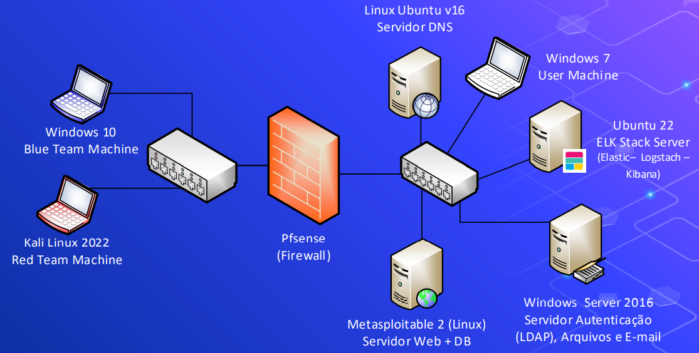

# Ambiente-Simulado

Ambiente virtualizado para simulação de testes de invasão e monitoramento de ataques.

# Sumário

- [Proposta](#proposta)
  - [Imersão](#imersão)
  - [Fase 01](#fase-01)
  - [Ambiente de Simulação](#ambiente-de-simulação)
  - [Regras de Conectividade do Ambiente](#regras-de-conectividade-do-ambiente)
- [Etapas do Projeto](#etapas-do-projeto)

# Proposta

Construir um ambiente virtualizado para simulação de testes de invasão e monitoramento de ataques. O ambiente será composto por máquinas virtuais e sistemas embarcados onde dever ser possível o estudo cenários de ataques, ferramentas e monitoria de eventos.

## Imersão

- A área de Segurança Cibernética é multidisciplinar e envolve o conhecimentos diversos como sistemas operacionais, ferramentas, desenvolvimento de softwares, dentre outros.
- Assim a proposta do Desafio é introduzir os alunos em um ambiente onde eles terão contato com cenários simplificados, mas coerentes, com o desafios e tecnologias utilizadas no dia a dia das empresas.

## Fase 01

- As equipes deverão construir um ambiente virtualizado e um sistema de monitoramento de incidentes para este ambiente, que possibilite a criação de cenários de simulação e a detecção de incidentes nestes cenários.
- Após a criação do ambiente serão propostos desafios de levantamento de vulnerabilidades, teste de invasão, exploração de vulnerabilidades, ataques de vírus que deverão ser detectados pelos sistemas de monitoramento.

## Ambiente de Simulação

## Regras de conectividade do ambiente

1. O Servidor Web e de DNS são acessíveis tanto na rede interna quanto externa. As demais máquinas não.
1. O computador de usuário (User Machine) pode acessar computadores fora da rede, mas não pode ser acessado remotamente.
1. O computador Blue Team pode acessar qualquer computador da rede interna.
1. O computador Red Team pode acessar apenas o Servidor Web e Servidor de DNS.
1. Todas as máquinas devem ter um endereço de IP Fixo.
1. As máquinas devem estar em uma rede sem acesso a internet e isolada das demais redes.

## Etapas do Projeto

Neste repositório está apresentada toda documentação técnica do projeto.

### F1E1 Workshops

- [**ELK Stack**](./F1_Ambiente-Virtualizado/F1E1_Workshops/ELK_Stack/Apresentacao_ELK_Stack.pdf)
- [**Kali Linux**](./F1_Ambiente-Virtualizado/F1E1_Workshops/KaliLinux/Workshop_Kali.pdf)
- [**Linux**](./F1_Ambiente-Virtualizado/F1E1_Workshops/Linux/Workshop_Linux_rev1.pdf)
- [**pfSense**](./F1_Ambiente-Virtualizado/F1E1_Workshops/pfSense/Workshop_PfSense.pdf)
- [**Windows Server**](./F1_Ambiente-Virtualizado/F1E1_Workshops/WindowsServer/Windows%20Server_Rev02.pdf)

### F1E2 Criando o Ambiente Virtualizado
  - [Habilitando e configurando o **Hyper-V** (Gerenciador do ambiente virtual)](./F1_Ambiente-Virtualizado/F1E2_Criando-Ambiente-Virtualizado/Hyper-V/hyper-v.md/#)
  - [Instalando o **Windows 10** (Blue Team Machine)](./F1_Ambiente-Virtualizado/F1E2_Criando-Ambiente-Virtualizado/Máquina%20Blue%20Team/Windows_10.md)
    - [Configurando Máquina Hyper-V Servidor]  
  - [Instalando o **Kali Linux 2022** (Red Team Machine)](./F1_Ambiente-Virtualizado/F1E2_Criando-Ambiente-Virtualizado/Máquina%20Red%20Team/Kali_Linux.md)
    - [Configurando Máquina Hyper-V Servidor] 
  - [Instalando o **pfSense** (Firewall)\*](./F1_Ambiente-Virtualizado/F1E2_Criando-Ambiente-Virtualizado/Firewall/pfSense.md)
  - [Instalando o **Servidor DNS**\*](./F1_Ambiente-Virtualizado/F1E2_Criando-Ambiente-Virtualizado/Servidor%20DNS/dnsServer.md)
  - [Instalando o **Windows 7** (User Machine)\*](./F1_Ambiente-Virtualizado/F1E2_Criando-Ambiente-Virtualizado/Máquinas%20Clientes/Windows_7.md)
  - [Instalando o **Metasploitable 2** (Web Server + DB)\*](./F1_Ambiente-Virtualizado/F1E2_Criando-Ambiente-Virtualizado/Servidor%20Web/metasploitable2.md)
  - [Instalando o **Windows Server 2016** (Servidor de autenticação LDAP, Arquivos e E-mail)](./F1_Ambiente-Virtualizado/F1E2_Criando-Ambiente-Virtualizado/Active%20Directory/01%20Instalação%20Windows%20Server%202016.md)
    - [ADDS](./F1_Ambiente-Virtualizado/F1E2_Criando-Ambiente-Virtualizado/Active%20Directory/02%20ADDS%20-%20Instalação%20e%20configuração%20básica.md)
    - [LDAP](./F1_Ambiente-Virtualizado/F1E2_Criando-Ambiente-Virtualizado/Active%20Directory/03%20LDAP%20over%20SSL.md) 
    - [DNS Forwarding](./F1_Ambiente-Virtualizado/F1E2_Criando-Ambiente-Virtualizado/Active%20Directory/04%20DNS%20forwarding.md)
    - [Servidor de Email](./F1_Ambiente-Virtualizado/F1E2_Criando-Ambiente-Virtualizado/Active%20Directory/05%20Servidor%20de%20e-mails.md)
  - [Instalando o **ELK Stack** (SIEM)](./F1_Ambiente-Virtualizado/F1E2_Criando-Ambiente-Virtualizado/SIEM/ELK.md)

### F1E3 Simulando Ambiente Virtualizado
  - **Red Team**
    - [Simulação **Ataque - Kali**](./F1_Ambiente-Virtualizado/F1E3_Simulando-Ambiente-Virtualizado/kali.md)
  - **Blue Team**
    - [Resultados - Relatório **Ataques ao FTP**](./F1_Ambiente-Virtualizado/F1E3_Simulando-Ambiente-Virtualizado/Resultados/Ataque-ao-ftp)
    - [Resultados - Relatório **Brute Force - SSH**](./F1_Ambiente-Virtualizado/F1E3_Simulando-Ambiente-Virtualizado/Resultados/Brute-force-ssh)
    - [Resultados - Relatório **NMAP no Servidor Web**](./F1_Ambiente-Virtualizado/F1E3_Simulando-Ambiente-Virtualizado/Resultados/Nmap-no-servidor-web)
  
### F2E1 Entendendo "Galileo Gen2"  
  - [Entendendo a  **Intel® Galileo Gen 2 Board**](./F2_Ambiente-IoT/F2E1_Entendendo-GalileoGen2/documentação.md)

### F2E2 Integrando "Galileo Gen2"
  - [Configurando **Intel® Galileo Gen 2 Board**](./F2_Ambiente-IoT/F2E2_Integrando-GalileoGen2/galileoGen2.md)

### F2E3 Simulando Ambiente Galileo Gen2"
  - **Red Team**
    - [Simulação **Ataque - Manual**](./F2_Ambiente-IoT/F2E3_Simulando-Ambiente-GalileoGen2/simulação.md) 
  - **Blue Team**
    - [Resultados - Relatório **Brute Force Manual - Placas**](./F2_Ambiente-IoT/F2E3_Simulando-Ambiente-GalileoGen2/Resultado/Brute-force-manual-placas)

##### \*Documentação em desenvolvimento, consulte [status do projeto](./docStatus.md) ou a branch **develop** pode ser que já esteja disponível por lá ;).

# 
